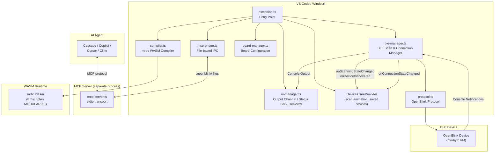
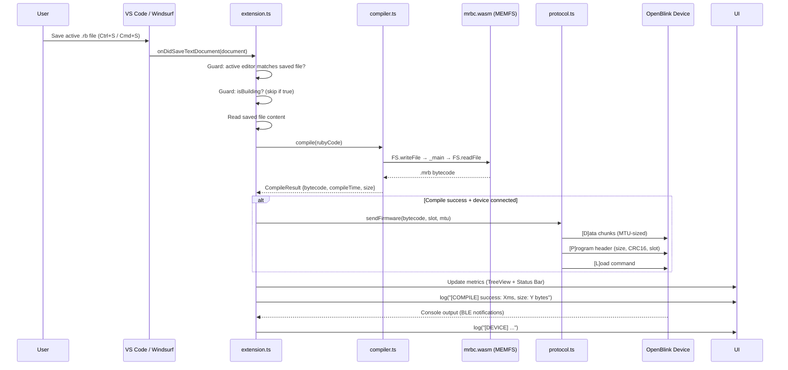
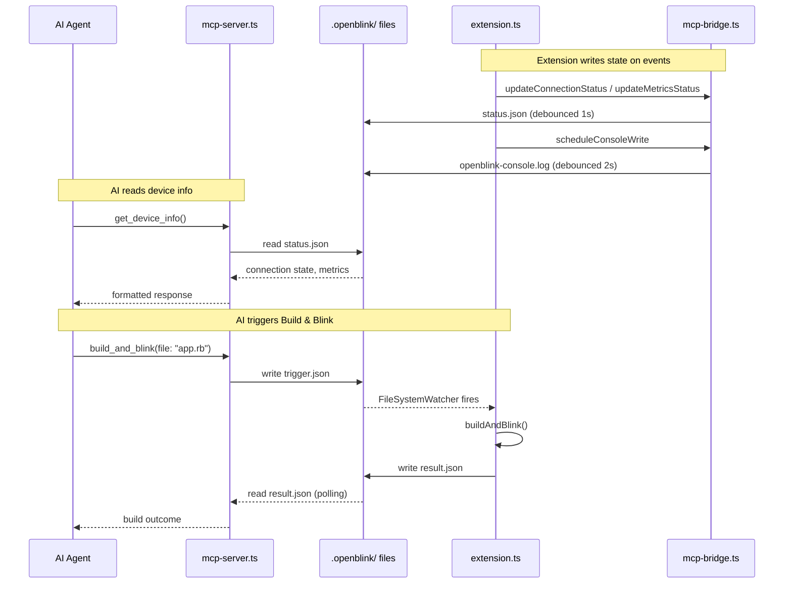

# System Architecture

This document describes the architecture of the OpenBlink VSCode Extension.

## High-Level Overview

## Module Responsibilities

| Module | File | Responsibility |
|--------|------|---------------|
| Entry Point | `extension.ts` | Command registration, module orchestration, saved-device persistence, configuration change listener |
| Compiler | `compiler.ts` | Load mrbc WASM, compile `.rb` → `.mrb`, diagnostic parsing (1-indexed → 0-indexed) |
| BLE Manager | `ble-manager.ts` | Device scan (`startScan`/`stopScan`), connect (`connectById`), disconnect, reconnect, MTU negotiation with floor guard |
| Protocol | `protocol.ts` | OpenBlink BLE protocol (D/P/L/R commands), CRC16, input validation (size/slot/MTU) |
| Board Manager | `board-manager.ts` | Board configurations with runtime JSON validation, sample code, references (defaults to Generic board) |
| UI Manager | `ui-manager.ts` | Output Channel, Status Bar, Diagnostics, TreeView providers (Tasks, DeviceInfo, Metrics, **Devices**, BoardReference, **McpStatus**), console ring buffer |
| MCP Bridge | `mcp-bridge.ts` | File-based IPC between extension and MCP server (debounced `status.json`, `openblink-console.log`, `trigger.json`, `result.json`) |
| MCP Server | `mcp-server.ts` | Standalone stdio MCP server exposing 5 tools (`build_and_blink`, `get_device_info`, `get_console_output`, `get_metrics`, `get_board_reference`) |
| Types | `types.ts` | Shared type definitions, BLE constants (`MIN_USABLE_MTU`, `CHARACTERISTIC_DISCOVERY_TIMEOUT`, etc.), `SavedDevice` |

## Data Flow: Build & Blink

When the user saves a `.rb` file that is focused in the active editor, an
`onDidSaveTextDocument` listener triggers the build-and-blink cycle.  A
concurrency guard (`isBuilding`) prevents overlapping operations — if a build
is already in progress the new request is silently skipped.

If the device is not connected, compilation still runs and metrics are recorded, but the BLE transfer is skipped with a warning.

Background saves (e.g. `files.autoSave`, format-on-save of non-focused files) do not trigger a build.  The extension uses `onWillSaveTextDocument` to record saves whose reason is `Manual` and ignores all others, ensuring BLE transfers only occur from explicit user action.

## Data Flow: MCP Integration

The MCP server runs as a separate stdio-based Node.js process, launched by the IDE's MCP client.  It communicates with the extension through JSON files in the `.openblink/` directory (file-based IPC).

The `openblink.mcp.enabled` setting (default `true`) controls whether the MCP bridge writes IPC files and watches for triggers.  When disabled, no disk I/O occurs and the MCP server definition provider returns an empty array.  Existing IPC files are left on disk but become stale.

For Windsurf, a Cascade Hook (`.windsurf/hooks.json` → `post_write_code`) automatically creates a `trigger.json` when Cascade edits a `.rb` file, providing transparent Build & Blink without explicit MCP tool calls.
