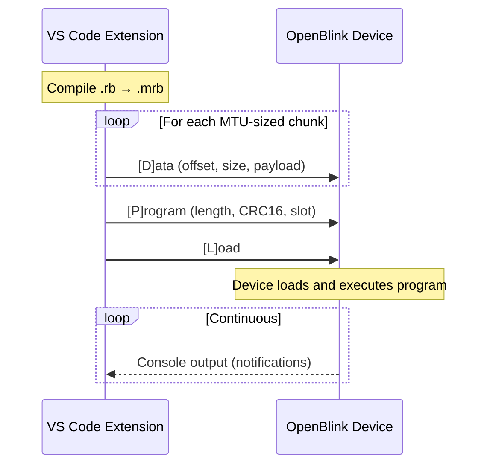
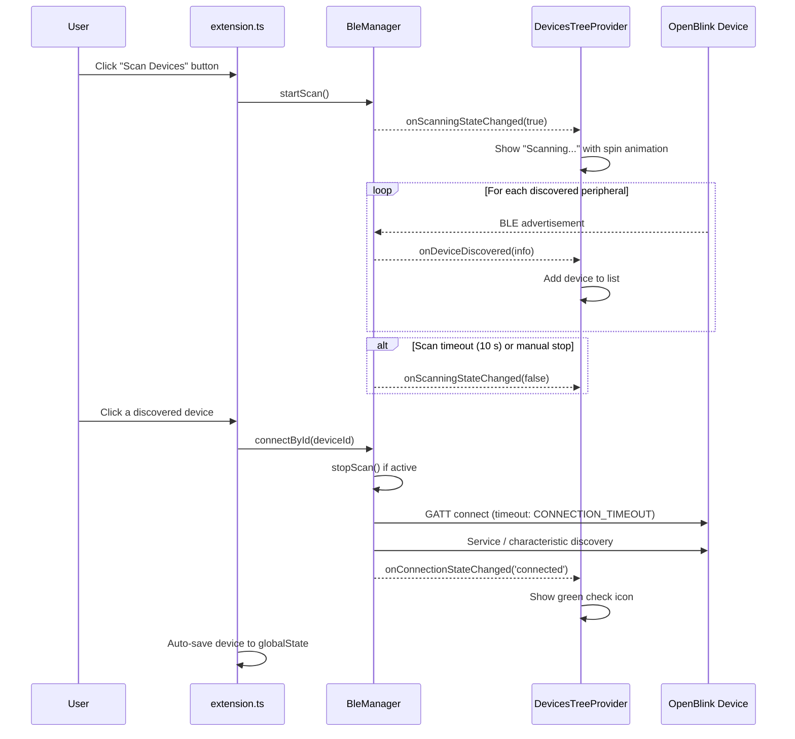

# OpenBlink BLE Protocol

This document describes the Bluetooth Low Energy protocol used by OpenBlink devices.

## Service and Characteristics

| Name | UUID |
|------|------|
| OpenBlink Service | `227da52c-e13a-412b-befb-ba2256bb7fbe` |
| Program Characteristic | `ad9fdd56-1135-4a84-923c-ce5a244385e7` |
| Console Characteristic | `a015b3de-185a-4252-aa04-7a87d38ce148` |
| Negotiated MTU Characteristic | `ca141151-3113-448b-b21a-6a6203d253ff` |

## Command Format

All commands use version byte `0x01` as the first byte.

### Data Command (`D`)

Sends a chunk of bytecode data to the device.

| Offset | Size | Field | Description |
|--------|------|-------|-------------|
| 0 | 1 | version | `0x01` |
| 1 | 1 | command | `'D'` (0x44) |
| 2 | 2 | offset | Data offset (little-endian) |
| 4 | 2 | size | Chunk size (little-endian) |
| 6 | N | payload | Bytecode data |

Chunk size = `negotiatedMTU - 6` (DATA_HEADER_SIZE).

### Program Command (`P`)

Sends the program header after all data chunks are transmitted.

| Offset | Size | Field | Description |
|--------|------|-------|-------------|
| 0 | 1 | version | `0x01` |
| 1 | 1 | command | `'P'` (0x50) |
| 2 | 2 | length | Total bytecode length (little-endian) |
| 4 | 2 | crc16 | CRC16 checksum (little-endian) |
| 6 | 1 | slot | Program slot (1 or 2) |
| 7 | 1 | reserved | `0x00` |

### Load Command (`L`)

Instructs the device to **reload the mruby/c VM without restarting the microcontroller**.

When the device receives this command it first terminates every running mruby/c task and deletes them from the scheduler. It then re-reads the bytecodes stored in each slot from non-volatile memory (or falls back to the factory-default programs if no stored bytecode is available), creates fresh tasks for the loaded bytecodes, and resumes execution via `mrbc_run()`. Because only the VM layer is recycled, all C-level services — including the BLE connection, the debug console subscription, and the RTOS threads — remain active throughout. This is the mechanism that enables the sub-0.1-second "Blink" rewrite experience.

| Offset | Size | Field | Description |
|--------|------|-------|-------------|
| 0 | 1 | version | `0x01` |
| 1 | 1 | command | `'L'` (0x4C) |

### Reset Command (`R`)

Triggers a **full microcontroller reboot**.

Unlike the Load command, a Reset tears down everything: the BLE connection is dropped, the mruby/c VM is destroyed, and the device goes through its entire boot sequence — hardware initialization, flash storage mount, BLE stack bring-up, and advertising restart. Use this command when a clean hardware-level restart is required, for example after a firmware update or to recover from an unexpected state.

| Offset | Size | Field | Description |
|--------|------|-------|-------------|
| 0 | 1 | version | `0x01` |
| 1 | 1 | command | `'R'` (0x52) |

## CRC16

The CRC16 algorithm uses reflected polynomial `0xD175` with seed `0xFFFF`. (provides Hamming Distance 4 protection for data lengths up to 32751 bits)
Reference: https://users.ece.cmu.edu/~koopman/crc/index.html

The firmware verifies the CRC. If the checksum does not match, the device responds with an `"ERROR: CRC mismatch"` notification.

```
function crc16_reflect(poly, seed, data):
    crc = seed
    for each byte in data:
        crc ^= byte
        for j = 0 to 7:
            if crc & 1:
                crc = (crc >>> 1) ^ poly
            else:
                crc = crc >>> 1
    return crc & 0xFFFF
```

## Maximum Program Size

The `offset` field in the Data command and the `length` field in the Program command are both `uint16` (2 bytes, little-endian), limiting the maximum program size to **65,535 bytes**. The extension validates this before transfer and rejects programs that exceed this limit.

## Input Validation

`sendFirmware()` validates all parameters before beginning the transfer:

| Check | Condition | Error |
|-------|-----------|-------|
| Empty program | `mrbContent.length === 0` | `Program is empty (0 bytes)` |
| Size overflow | `mrbContent.length > 0xFFFF` | Exceeds 65535 bytes |
| Invalid slot | `slot !== 1 && slot !== 2` | Must be 1 or 2 |
| MTU too small | `negotiatedMTU <= DATA_HEADER_SIZE` | Must be > 6 to carry at least 1 payload byte |

## Firmware Transfer Sequence



## MTU Negotiation

### Extension side (IDE → device)

1. Try `gatt.requestMTU(512)` if available
2. Fallback: Read `Negotiated MTU Characteristic` (uint16, little-endian), subtract 3
3. Final fallback: Use default MTU of 20 bytes
4. **Floor check**: If the result is below `MIN_USABLE_MTU` (7), fall back to the default MTU of 20 to guarantee at least 1 byte of payload per data packet

Data payload size per chunk = `negotiatedMTU - 6`.

## Device Scan Lifecycle

Device scanning and connection are separate operations managed by `BleManager`:



- **`startScan()`** — Clears previously discovered devices, begins BLE scanning filtered by the OpenBlink service UUID, and auto-stops after `SCAN_TIMEOUT` (10 s).
- **`stopScan()`** — Cancels an active scan and removes the manager's own Noble `discover` listener (does not affect other listeners on the Noble singleton).
- **`connectById(deviceId)`** — Looks up the device in the discovered map, stops scanning if active, and establishes a full GATT connection. The underlying `connectAsync()` is guarded by `CONNECTION_TIMEOUT` (10 s) to prevent hanging when the device is not advertising (e.g. after a previous disconnection without device restart).

Previously connected devices are persisted in `globalState` as `SavedDevice` records (name + ID). When the user clicks a saved device, a scan is triggered automatically to rediscover the peripheral before connecting.

## Error Notifications

Errors during bytecode transfer are reported as notifications on the **Program** characteristic (not Console). Common error strings:

| Error string | Cause |
|-------------|-------|
| `"ERROR: Blink version mismatch"` | Protocol version ≠ `0x01` |
| `"ERROR: Blink data size error"` | Data chunk header size + payload ≠ received length |
| `"ERROR: Size exceeds buffer limits"` | Offset + size > `BLINK_MAX_BYTECODE_SIZE` (device side) |
| `"ERROR: CRC mismatch"` | CRC16 verification failed |
| `"ERROR: Blink program error"` | Storage write failed |
| `"ERROR: Blink size mismatch"` | Program command length ≠ expected 8 bytes |
| `"ERROR: Blink unknown type"` | Unrecognized command byte |

On success, the device sends `"OK slot:<N>"` via the Program characteristic.

## Console

The Console Characteristic sends text data via BLE notifications. The extension subscribes to these notifications and displays them in the Output Channel with `[DEVICE]` prefix.
