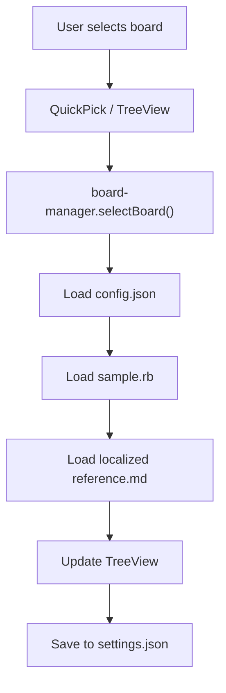

# Board Configuration

This document describes how board definition files work and how to add new boards.

## Directory Structure

Each board has its own directory under `resources/boards/`:

```
resources/boards/
├── generic/
│   ├── config.json          # Board metadata (required)
│   ├── sample.rb            # Sample code (required)
│   └── reference.md         # English reference (required)
├── m5stamps3/
│   ├── config.json          # Board metadata (required)
│   ├── sample.rb            # Sample code (required)
│   ├── reference.md         # English reference (required)
│   ├── reference.ja.md      # Japanese reference (optional)
│   ├── reference.zh-cn.md   # Simplified Chinese reference (optional)
│   └── reference.zh-tw.md   # Traditional Chinese reference (optional)
└── xiao-nrf54l15/
    ├── config.json
    ├── sample.rb
    └── reference.md
```

## config.json Format

```json
{
  "name": "generic",
  "displayName": "Generic",
  "manufacturer": "Generic",
  "description": "Generic board with mruby/c release3.4.1 standard library functions"
}
```

| Field | Type | Required | Description |
|-------|------|----------|-------------|
| `name` | string | Yes | Board identifier (must match directory name) |
| `displayName` | string | Yes | Human-readable board name |
| `manufacturer` | string | Yes | Board manufacturer |
| `description` | string | Yes | Short description of the board |

> **Runtime validation**: `board-manager.ts` validates that all required fields are present and are non-empty strings at load time. Boards with missing or invalid fields are silently skipped.

## sample.rb

A working Ruby sample program for the board. This is shown when a user selects the board.

```ruby
# Generic Board Sample - Standard mruby/c Functions
# Demonstrates basic mruby/c release3.4.1 standard library usage

# Array operations
numbers = [1, 2, 3, 4, 5]
puts "Array: #{numbers}"

# String operations
text = "Hello, mruby/c!"
puts "String: #{text.upcase}"

# Hash operations
data = {name: "Generic", version: "3.4.1"}
puts "Hash: #{data}"

# Math operations
puts "PI: #{Math::PI}"
puts "Sqrt(16): #{Math.sqrt(16)}"
```

## Reference Documentation

Markdown files describing the board's API. The extension selects the appropriate language version based on VS Code's locale setting.

**File naming convention:**
- `reference.md` — English (default, required)
- `reference.ja.md` — Japanese
- `reference.zh-cn.md` — Simplified Chinese
- `reference.zh-tw.md` — Traditional Chinese

## Adding a New Board

1. Create a directory: `resources/boards/<board-name>/`
2. Create `config.json` with the board metadata
3. Create `sample.rb` with a working example
4. Create `reference.md` with API documentation
5. Optionally add localized reference files
6. Add the board name to the `BOARD_LIST` array in `src/board-manager.ts`:

```typescript
const BOARD_LIST = ['generic', 'm5stamps3', 'xiao-nrf54l15', 'your-new-board'];
```

7. Rebuild the extension (`npm run compile`)

## Board Selection

On first launch, the Generic board is automatically selected as the default board, providing mruby/c release3.4.1 standard library functions. The previous selection is restored from the `openblink.board` setting if available, otherwise Generic board is used.


