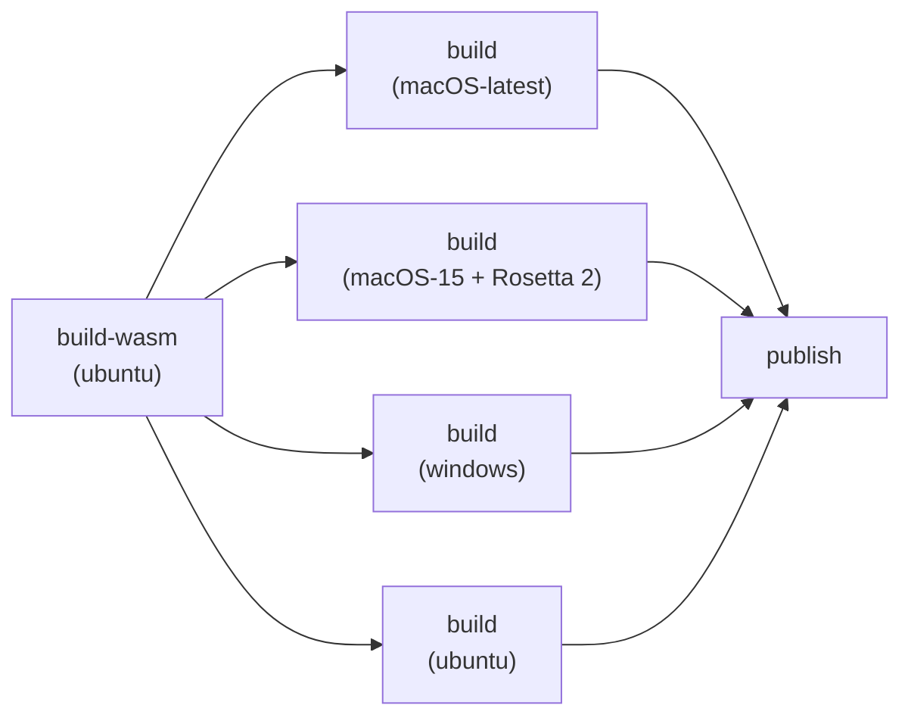

# Build System

This document describes how to build the OpenBlink VS Code extension, including the mrbc WASM compiler.

## Prerequisites

- Git (with submodule support)
- Node.js 18+
- Python 3 (required by Emscripten)
- Make
- Ruby (required by mruby build system)

## First-Time Setup

```bash
# Clone with submodules
git clone --recursive https://github.com/OpenBlink/openblink-vscode-extension.git
cd openblink-vscode-extension

# Or initialize submodules in an existing clone
git submodule update --init --recursive

# Install and activate Emscripten 5.0.5
make setup-emsdk

# Activate Emscripten in your shell
source vendor/emsdk/emsdk_env.sh
```

## Building mrbc WASM

```bash
# Activate Emscripten (if not already done in this shell)
source vendor/emsdk/emsdk_env.sh

# Build mrbc WASM (prerequisite checks run automatically)
make
```

The `make` command automatically verifies that `emcc`, `ruby`, and `rake` are available before building.

Output files:
- `resources/wasm/mrbc.js` — Emscripten MODULARIZE JS wrapper
- `resources/wasm/mrbc.wasm` — WebAssembly binary

## VS Code Extension Build

```bash
npm install
npm run compile    # webpack production build
npm run watch      # webpack dev watch mode
npm run package    # Create .vsix package
```

## Build Configuration

The mruby cross-compilation is configured in `mruby_build_config.rb`:

| Setting | Value | Purpose |
|---------|-------|---------|
| `ENVIRONMENT` | `node` | Target Node.js for VS Code extension |
| `MODULARIZE` | `1` | Export as factory function `createMrbc()` |
| `EXPORT_NAME` | `createMrbc` | CommonJS module export name |
| `EXPORT_ES6` | `0` | CommonJS format (not ES modules) |
| `FORCE_FILESYSTEM` | `1` | Enable MEMFS virtual filesystem |
| `INVOKE_RUN` | `0` | Don't auto-run main() |
| `WASM` | `1` | Output WebAssembly |
| `INITIAL_MEMORY` | 32MB | Initial memory allocation |
| `MAXIMUM_MEMORY` | 256MB | Maximum memory with growth |
| `MALLOC` | `emmalloc` | Lightweight allocator |

## Makefile Targets

| Target | Description |
|--------|-------------|
| `all` (default) | Build mrbc |
| `setup-emsdk` | Install and activate Emscripten 5.0.5 |
| `mrbc` | Build mrbc with prerequisite checks |
| `clean` | Remove all build artifacts |
| `rebuild` | Clean and rebuild all |
| `help` | Show available targets |

## Emscripten 5.0.5 Migration Notes

Upgraded from Emscripten 4.0.23. Key changes:

- **Flag syntax**: Use `-sFLAG=value` (without space after `-s`)
- **5.0.0**: LLVM 21.1.8, new `-sEXECUTABLE` setting
- **5.0.1**: `WASM_OBJECT_FILES` setting removed
- **5.0.3**: `FS.write` only accepts TypedArray
- **5.0.5**: C++ exceptions always thrown as CppException objects

## Platform-Specific VSIX Packaging

The extension uses **platform-specific VSIX builds** to include the correct native BLE bindings for each OS. This follows the [VS Code official guidance](https://code.visualstudio.com/api/working-with-extensions/publishing-extension#platformspecific-extensions) (supported since VS Code 1.61.0).

### Why Platform-Specific?

`@abandonware/noble` compiles a native `.node` binding via `node-gyp` during `npm ci`. The binding is OS-specific:

| Platform | Native Binding | Loaded by |
|----------|---------------|-----------|
| macOS (arm64 / x64) | CoreBluetooth (`binding.node`) | `node-gyp-build` → `build/Release/binding.node` |
| Windows (x64) | WinRT (`binding.node`) | `node-gyp-build` → `build/Release/binding.node` |
| Linux (x64) | HCI socket (`bluetooth_hci_socket.node`) | `@abandonware/bluetooth-hci-socket` → `build/Release/bluetooth_hci_socket.node` |

Since `build/Release/` can only hold one platform's binary, a universal VSIX is not possible.

### Release Pipeline (3-Job)



| Job | Runner | Output |
|-----|--------|--------|
| `build-wasm` | ubuntu-latest | `mrbc.js` + `mrbc.wasm` |
| `build` (×4) | matrix per OS | Platform-specific `.vsix` file |
| `publish` | ubuntu-latest | Publish all VSIXs to Marketplace, Open VSX, GitHub Release |

Each `build` job runs `npm ci` on its native OS, which compiles the correct `binding.node`. Then `vsce package --target <platform>` produces a VSIX containing only that platform's binary.

The `darwin-x64` target runs on `macos-15` (arm64) with `actions/setup-node` configured to install x64 Node.js. Rosetta 2 translates the x64 process, ensuring `node-gyp` compiles the correct x64 native binding.

### User Experience

End users do not need to be aware of the platform-specific packaging. VS Code Marketplace and Open VSX automatically serve the correct VSIX for the user's platform. The install experience is identical to any other extension.

For manual `.vsix` installation from GitHub Releases, users should select the file matching their platform (e.g., `openblink-darwin-arm64-x.y.z.vsix`).

### Local Packaging

```bash
# Package for the current platform
npx @vscode/vsce package --target darwin-arm64   # macOS Apple Silicon
npx @vscode/vsce package --target darwin-x64     # macOS Intel
npx @vscode/vsce package --target win32-x64      # Windows
npx @vscode/vsce package --target linux-x64      # Linux
```

### Runtime Dependencies in VSIX

Noble's runtime dependencies are explicitly unignored in `.vscodeignore`:

| Dependency | Included paths | Purpose |
|------------|---------------|---------|
| `@abandonware/noble` | `package.json`, `index.js`, `with-custom-binding.js`, `lib/**/*.js`, `lib/**/*.json`, `build/Release/binding.node` | BLE library + native addon |
| `@abandonware/bluetooth-hci-socket` | `package.json`, `index.js`, `lib/native.js`, `build/Release/bluetooth_hci_socket.node` | Optional dependency; used by the extension for Linux HCI-socket transport |
| `node-gyp-build` | `**` | Locates and loads `.node` binary at runtime (macOS/Windows) |
| `debug` | `**` | Logging in noble's JS code |
| `ms` | `**` | Dependency of `debug` |

Build-time only dependencies (`node-addon-api`, `napi-thread-safe-callback`, `nan`, `node-gyp`, `@mapbox/node-pre-gyp`) and native C++ source files (`*.cc`, `*.h`, `*.mm`, `*.gyp`) are excluded.

> **Note**: `vsce` uses flat negate semantics — a `!` pattern always overrides all ignore patterns regardless of order. To exclude build artifacts, each negate pattern must target only the specific files needed at runtime (e.g., `!noble/lib/**/*.js`) rather than broad globs (e.g., `!noble/**`).

## Clean and Rebuild

```bash
make clean    # Remove build artifacts
make rebuild  # Clean + build
```
