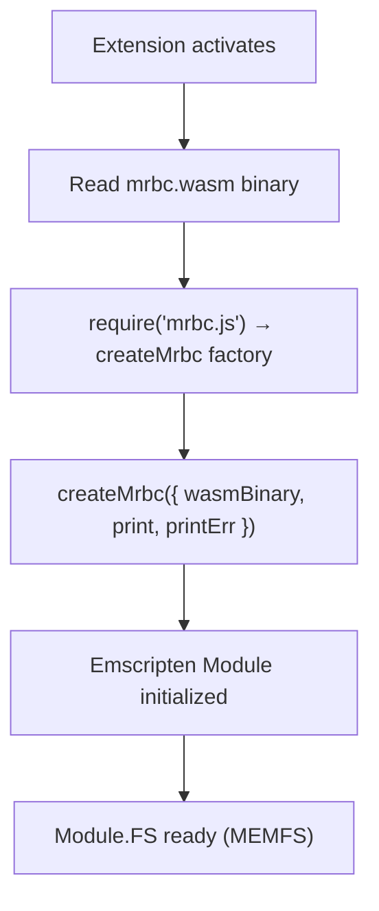
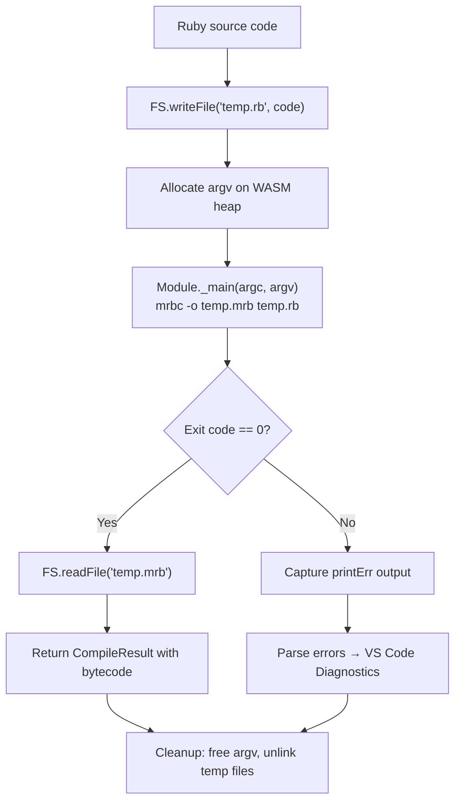

# mrbc WASM Compiler

This document describes how the mruby bytecode compiler (mrbc) works within the VS Code extension.

## Overview

The extension uses Emscripten-compiled mrbc running as WebAssembly in the Node.js extension host. The MODULARIZE pattern provides safe, isolated module instances without `eval()`.

## Loading Flow



## Compilation Flow



## MODULARIZE Pattern

Instead of loading Emscripten output via `eval()` (security concern), we use:

```typescript
// mruby_build_config.rb generates: module.exports = function createMrbc(options) { ... }
// __non_webpack_require__ bypasses webpack's static analysis for dynamic module loading
const dynamicRequire = typeof __non_webpack_require__ !== 'undefined' ? __non_webpack_require__ : require;
const createMrbc = dynamicRequire(mrbcJsPath);

// Dynamic closure variables — swapped before each compile() call
let activePrintCallback = null;
let activePrintErrCallback = null;

const Module = await createMrbc({
  wasmBinary: fs.readFileSync('mrbc.wasm').buffer,
  print: (text) => { if (activePrintCallback) activePrintCallback(text); },
  printErr: (text) => { if (activePrintErrCallback) activePrintErrCallback(text); },
});
```

The module is initialized once as a **singleton** and reused across compilations.
`activePrintCallback` / `activePrintErrCallback` are set before each `compile()` call
and reset in the `finally` block, enabling per-call capture of stdout/stderr.

Benefits:
- **No `eval()`** — CSP compliant, no global namespace pollution
- **Singleton reuse** — Module initialized once, callbacks swapped per call
- **Dynamic callback routing** — `print`/`printErr` route output to the caller's callbacks
- **webpack compatible** — Standard CommonJS `require()`

## Memory Model

The WASM module uses Emscripten's MEMFS (in-memory virtual filesystem):

- `FS.writeFile()` / `FS.readFile()` operate on virtual files in memory
- No real filesystem access (NODEFS/NODERAWFS not used)
- Temporary files are cleaned up after each compilation
- Memory grows up to 256MB as needed (`ALLOW_MEMORY_GROWTH`)

## Error Handling

mrbc error output format: `filename:line:col: message`

The extension parses this into VS Code Diagnostics:
- Both line and column numbers are converted from 1-indexed (mrbc output) to 0-indexed (VS Code `Range`)
- Errors appear inline in the editor
- Problems panel shows all compile errors
- AI tools (Windsurf Cascade) can reference diagnostics for fix suggestions
- Compiler initialization failure is surfaced to the user via `showErrorMessage`

## Structured Output

```
[COMPILE] success: 12.5ms, size: 256 bytes
[COMPILE] error: temp_input.rb:3:0: syntax error, unexpected end-of-input
```
