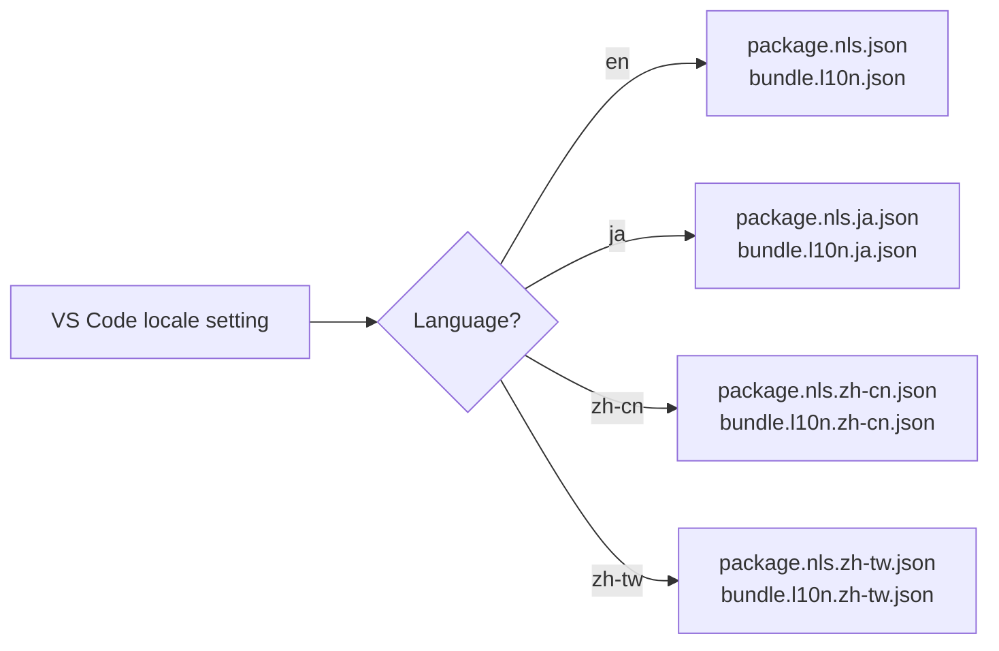

# Internationalization (i18n)

This document describes how multi-language support is implemented.

## Supported Languages

| Locale | Language | Mapping |
|--------|----------|---------|
| `en` | English | Default |
| `ja` | やさしい日本語 (Easy Japanese) | VS Code Japanese locale |
| `zh-cn` | 简体中文 | VS Code Simplified Chinese locale |
| `zh-tw` | 繁體中文 | VS Code Traditional Chinese locale |

## Architecture

The extension uses the official VS Code localization mechanism (`@vscode/l10n`), stable since VS Code 1.73.

### Two-Layer Approach

1. **`package.nls.*.json`** — Translates `package.json` strings (command titles, setting descriptions, view names)
2. **`l10n/bundle.l10n.*.json`** — Translates runtime strings in TypeScript code



## Usage in Code

```typescript
import * as l10n from '@vscode/l10n';

// Simple message
vscode.window.showInformationMessage(l10n.t('Soft reset executed'));

// Message with parameters
outputChannel.appendLine(l10n.t('Compilation successful: {0}ms, size: {1} bytes', compileTime, size));
```

## Structured Output Prefixes

Output Channel prefixes (`[COMPILE]`, `[TRANSFER]`, `[DEVICE]`, `[BLE]`, `[SYSTEM]`) are **always in English** to ensure AI tools (Windsurf Cascade) can reliably parse them regardless of locale.

```
[COMPILE] success: 12.5ms, size: 256 bytes      ← English prefix, always
[DEVICE] Hello from mruby!                       ← Device output, as-is
[BLE] デバイスにつながりました: OpenBlink-M5S3    ← Localized user message
```

## Adding Translations

1. Add keys to `l10n/bundle.l10n.json` (English default)
2. Add translations to `l10n/bundle.l10n.ja.json`, `zh-cn.json`, `zh-tw.json`
3. For `package.json` strings, update `package.nls.*.json` files
4. Use `l10n.t('key')` or `l10n.t('message with {0}', param)` in code

## Current `package.nls` Keys

Below is a reference of all keys used in `package.nls.*.json`. New keys added for the Devices view are marked with ✱.

| Key | English Default | Purpose |
|-----|-----------------|---------|
| `displayName` | OpenBlink | Extension name in Marketplace |
| `description` | … | Extension description |
| `command.connectDevice` | Connect Device | Legacy connect command |
| `command.disconnectDevice` | Disconnect Device | Disconnect command |
| `command.buildAndBlink` | Build & Blink | Compile + transfer |
| `command.softReset` | Soft Reset | Device soft reset |
| `command.selectSourceFile` | Select Source File | Source file picker |
| `command.selectBoard` | Select Board | Board picker |
| `command.selectSlot` | Select Slot | Slot picker |
| ✱ `command.scanDevices` | Scan Devices | Start BLE scan |
| ✱ `command.stopScan` | Stop Scan | Stop BLE scan |
| ✱ `command.forgetDevice` | Forget Device | Remove saved device |
| `command.setupMcp` | Setup MCP Server | Generate MCP configuration snippet |
| ✱ `view.devices` | Devices | Devices TreeView title |
| `view.tasks` | Tasks | Tasks TreeView title |
| `view.deviceInfo` | Device Info | Device info TreeView title |
| `view.metrics` | Metrics | Metrics TreeView title |
| `view.boardReference` | Board Reference | Board reference TreeView title |
| `view.mcpStatus` | MCP Status | MCP status TreeView title |
| `config.slot` | Program slot number (1 or 2) | Default slot setting |
| `config.sourceFile` | Ruby source file to compile | Default source file path |
| `config.board` | Target board name | Default board selection |
| `config.mcp.enabled` | Enable MCP integration | MCP on/off toggle |

## Board References

Board reference documents (`reference.md`, `reference.ja.md`, etc.) are loaded based on `vscode.env.language` with English fallback.
